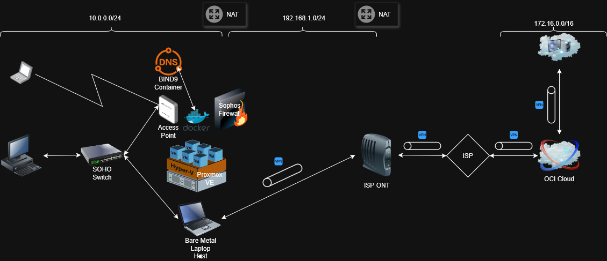

# 🔧 Home‑Lab — Hybrid Proxmox Lab with Site‑to‑Site VPN

**Short summary  **
A hands‑on home‑lab built on a Dell laptop running Proxmox VE. Demonstrates a hybrid network with a Sophos home firewall (virtualized), StrongSwan site‑to‑site IPsec to an OCI Ubuntu VM, local DNS/DDNS emulation, and lightweight file sharing. This repo documents design decisions, configuration snippets, deployment steps, automation, and lessons learned for engineers and hiring managers.
  
---

## 🔧 Overview

This project documents a compact, production‑inspired home‑lab used to learn and demonstrate virtualization, networking, VPNs, DNS automation, and container services.
The lab is intentionally small and reproducible so others can replicate or adapt it.

---

## ⚠️ Disclaimer
This is a permanent work-in-progress. I will be updating this repo consistently throughout time. Expect changes soon!

---

## 🎯 Goals
- Build a reproducible Proxmox‑based home‑lab.
- Demonstrate secure site‑to‑site IPsec (StrongSwan ↔ Sophos).
- Show DNS/DDNS integration with DHCP leases for realistic name resolution.
- Provide clear, copy‑pasteable configuration snippets and diagrams.
- Make the repo useful for peers, technicians, managers, and recruiters.

---

## 🗺️ Network topology

### Local network (10.0.0.0/24)

10.0.0.1 — Sophos Home Firewall (virtualized VM in Proxmox) edge; handles VPN, NAT, DHCP.

    DHCP range: 10.0.0.100–10.0.0.199 (served by Sophos DHCP).

10.0.0.200 — Proxmox VE (bare‑metal host; Type 1 hypervisor).

10.0.0.201 — BIND9 container — Local DNS / DDNS emulation (authoritative for lab; integrated with Sophos DHCP leases).

10.0.0.202 — Samba container — small file sharing between devices.

### Remote / Cloud

    OCI Private LAN: 172.16.0.0/16.
    
    OCI Ubuntu VM 172.16.1.99 — StrongSwan peer for site‑to‑site IPsec (Ubuntu is listed as software below).

    DYNU used for DDNS to handle ISP public IP rotation.

### Internet DNS (recursive / filtering)

    Cisco Umbrella resolvers used for upstream DNS filtering: 208.67.222.222 and 208.67.220.220.

---

## 🧾 Hardware and software inventory

- Hardware

    Dell laptop — Core i7 (4C/8T), 16GB DDR3, 120GB NVMe (Proxmox + ISOs), 240GB SATA SSD (VMs/CTs)

- Software / Services

   - Proxmox VE (bare‑metal Type 1 hypervisor; version noted in /docs/versions.md)
   - Sophos Home Firewall (virtualized inside Proxmox as a VM)
   - Ubuntu — guest OS in OCI for StrongSwan peer (and any other Linux VMs)
   - OCI Cloud (Network & Instances)
   - StrongSwan (IPsec implementation on Ubuntu VM)
   - BIND9 (container for local DNS + DDNS emulation)
   - Samba (container for file sharing)
   - DYNU (DDNS provider)
   - Cisco Umbrella (upstream DNS filtering; resolvers listed above)

---

## ⚙️ Configuration highlights

- StrongSwan: sample ipsec.conf and ipsec.secrets with comments and secure parameter recommendations. Runs on Ubuntu VM in OCI.
- Sophos: exported policy snippets and DHCP integration notes; Sophos runs as a VM inside Proxmox.
- BIND9: dynamic update examples and a script that emulates DDNS updates from DHCP leases (local DNS at 10.0.0.201).
- Samba: minimal secure share configuration for cross‑platform testing.
- Proxmox: notes on storage layout (NVMe for host/ISOs, SATA for VMs/CTs), backup recommendations, and VM templates.

## 🤝 Contributing

Contributions are welcome. Please:

 - Open an issue describing the change or improvement.
 - Create a branch feature/<short-desc>.
 - Submit a PR with tests or verification steps.

See CONTRIBUTING.md for templates and expectations.

## 🛣️ Roadmap

Planned items:

- Add automated backups for VMs/CTs.
- Migrate containers to Docker. Integrate Kubernetes.
- Integrate monitoring (Prometheus + Grafana) with alerting.
- Add CI checks for config syntax and playbook linting.
- Expand self‑healing to include snapshot rollback for critical VMs.
- Publish a short blog post series documenting the build process.
