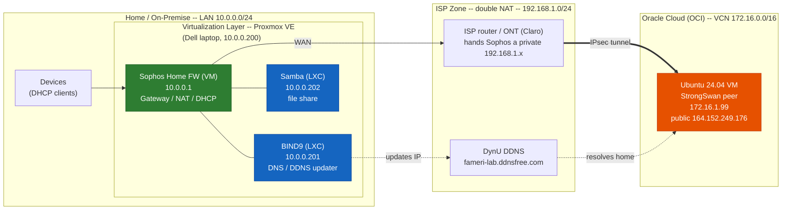

# 🔧 Home-Lab — Hybrid Proxmox Lab with Site-to-Site VPN

**A hands-on home-lab built on a Dell laptop running Proxmox VE.**  
A hybrid network with a virtualized Sophos Home firewall, a StrongSwan site-to-site IPsec tunnel to an Oracle Cloud Ubuntu VM, a self-built dynamic DNS service (BIND9 + a DHCP-lease sync script), and a small authenticated Samba share. This repo documents the design, the real configuration, the deployment steps, and — just as importantly — the bugs, gaps, and lessons that only showed up once the lab had been running a while.

---

## 📑 Table of Contents
1. [Status](#-status)
2. [Overview](#-overview)
3. [Goals](#-goals)
4. [Network topology](#️-network-topology)
5. [Hardware and software inventory](#-hardware-and-software-inventory)
6. [Configuration highlights](#️-configuration-highlights)
7. [Known issues & lessons](#-known-issues--lessons)
8. [Related documentation](#-related-documentation)
9. [Keywords](#-keywords)
10. [Contributions](#-contributions)
11. [License](#-license)

---

## 📌 Status

**Decommissioned.** Built November 2025 – April 2026, retired when I moved to new hardware and a new build.  
This repo is a historical record: how it worked, why it was built this way, and what I'd do differently — not a live, maintained project.

<a href="#-table-of-contents">↑ Back to top</a>

---

## 🔧 Overview

This project documents a compact, production-inspired home-lab used to learn and demonstrate virtualization, networking, VPNs, DNS automation, and container services.  
Everything below reflects the lab's **actual final state**, reconstructed directly from the hypervisor, the containers, the firewall, and the cloud console — not from earlier drafts of this README.

<a href="#-table-of-contents">↑ Back to top</a>

---

## 🎯 Goals

- **Virtualization** – Build a reproducible Proxmox-based home-lab on modest hardware.
- **Security** – Run a real edge firewall with policy, IPS, and VPN, and learn infrastructure security hands-on.
- **DNS automation** – Simulate enterprise-style dynamic DNS: DHCP leases automatically becoming forward + reverse records, without a heavyweight domain controller.
- **Connectivity** – Demonstrate a real site-to-site IPsec tunnel (StrongSwan ↔ Sophos) to a cloud VM, plus remote access back home.
- **File sharing** – Provide a small, authenticated cross-platform internal share.

<a href="#-table-of-contents">↑ Back to top</a>

---

## 🗺️ Network topology

```mermaid
flowchart LR
    subgraph HOME["Home / On-Premise -- LAN 10.0.0.0/24"]
        direction TB
        DEV["Devices<br/>(DHCP clients)"]
        subgraph VIRT["Virtualization Layer -- Proxmox VE<br/>(Dell laptop, 10.0.0.200)"]
            direction TB
            SOPHOS["Sophos Home FW (VM)<br/>10.0.0.1<br/>Gateway / NAT / DHCP"]
            BIND["BIND9 (LXC)<br/>10.0.0.201<br/>DNS / DDNS updater"]
            SAMBA["Samba (LXC)<br/>10.0.0.202<br/>file share"]
        end
        DEV --> SOPHOS
        SOPHOS --- BIND
        SOPHOS --- SAMBA
    end

    subgraph ISPZONE["ISP Zone -- double NAT -- 192.168.1.0/24"]
        direction TB
        ONT["ISP router / ONT (Claro)<br/>hands Sophos a private 192.168.1.x"]
        DYNU["DynU DDNS<br/>fameri-lab.ddnsfree.com"]
    end

    subgraph CLOUD["Oracle Cloud (OCI) -- VCN 172.16.0.0/16"]
        direction TB
        UBUNTU["Ubuntu 24.04 VM<br/>StrongSwan peer<br/>172.16.1.99<br/>public 164.152.249.176"]
    end

    SOPHOS -->|WAN| ONT
    BIND -.->|updates IP| DYNU
    ONT ==>|IPsec tunnel| UBUNTU
    DYNU -.->|resolves home| UBUNTU

    classDef fw fill:#2e7d32,stroke:#1b5e20,color:#fff
    classDef svc fill:#1565c0,stroke:#0d47a1,color:#fff
    classDef cloud fill:#e65100,stroke:#bf360c,color:#fff
    class SOPHOS fw
    class BIND,SAMBA svc
    class UBUNTU cloud
```

### Local network (`10.0.0.0/24`)

- **10.0.0.1** — Sophos Home Firewall (virtualized VM). Edge, NAT, DHCP, VPN endpoint.  
  DHCP range: `10.0.0.100–10.0.0.199`. Sophos itself sat behind a **double NAT** — its WAN interface got a private `192.168.1.x` address from the ISP router (Claro-Telmex), not a real public IP.
- **10.0.0.200** — Proxmox VE (bare-metal host).
- **10.0.0.201** — BIND9 LXC — dynamic DNS.
- **10.0.0.202** — Samba LXC — authenticated file share.
- **Guest WiFi** (`10.255.0.0/24`) — configured on a dedicated AP interface but never put into service.

### DNS — two layers, by design

1. **Static infrastructure** (Sophos, Proxmox, BIND9, Samba) got fixed hostname records directly in **Sophos's own DNS host table** — simple, and never needs to change.
2. **Dynamic clients** got real automation: a cron job on the BIND9 container pulled Sophos's live DHCP lease file via `scp` every 5 minutes, then used `nsupdate` (TSIG-secured) to push `A` and `PTR` records into BIND9's authoritative `lab.lan` zone. This is what let any LAN device resolve by hostname with no static config — see [`BIND9.md`](./BIND9.md) for the full build.

Sophos's DNS API was locked to only accept calls from BIND9's IP, since BIND9 was the only thing that ever needed it.

**Upstream filtering:** Cisco Umbrella (`208.67.222.222` / `208.67.220.220` for IPv4, `2620:119:35::35` / `2620:119:53::53` for IPv6) as Sophos's forwarder.

### Remote / Cloud (Oracle Cloud Infrastructure)

- Region `sa-vinhedo-1` (Brazil), Always Free tier.
- **Ubuntu 24.04 VM** (`VM.Standard.E2.1.Micro`, 1 OCPU / 1GB RAM) — private `172.16.1.99`, public `164.152.249.176`.
- VCN `172.16.0.0/16`, subnet `172.16.1.0/24`, internet gateway.
- **StrongSwan** ran the far end of the tunnel: IKEv2, PSK, `AES256/SHA256`, tunnel `172.16.0.0/16 ⇄ 10.0.0.0/24`. Stayed up continuously for 40+ days in its final stretch.
- **DDNS (DynU):** since Sophos sat behind ISP NAT, a cron job (on the BIND9 container, not Sophos) kept `fameri-lab.ddnsfree.com` pointed at the real public IP — the OCI side found home by hostname, not by a static IP.

<a href="#-table-of-contents">↑ Back to top</a>

---

## 🧾 Hardware and software inventory

**Hardware**
- Dell laptop — Core i7 (4C/8T), 16GB DDR3, NVMe drive (host + ISOs), SATA SSD (VMs/CTs).

**Software / Services**
- **Proxmox VE 9.2.3** (kernel 7.0.6-2-pve) — bare-metal Type 1 hypervisor.
- **Sophos Home Firewall** (free/registered edition, model `SFVH`) — virtualized.
- **BIND9** (unprivileged Debian LXC, 128MB) — dynamic DNS.
- **Samba** (unprivileged Debian LXC, 128MB, per-container firewall enabled) — file share.
- **Ubuntu 24.04** (OCI Always Free) + **StrongSwan 5.9.13** — site-to-site VPN peer.
- **DynU** — DDNS provider.
- **Cisco Umbrella** — upstream DNS filtering.

<a href="#-table-of-contents">↑ Back to top</a>

---

## ⚙️ Configuration highlights

- **BIND9** – TSIG-keyed dynamic zone (`lab.lan` forward + `0.0.10.in-addr.arpa` reverse), fed by a cron-driven sync script parsing Sophos's DHCP lease file. See [`BIND9.md`](./BIND9.md).
- **Samba** – single authenticated share (`valid users = fameri`), used as a quick secure internal file-transfer channel. See [`Samba.md`](./Samba.md).
- **Sophos** – default-accept policy for LAN↔LAN/WAN/VPN on common services, explicit bidirectional rules for the OCI tunnel, IPS + web filtering + NDR threat intelligence, weekly encrypted config backups emailed out automatically. Full write-up in [`firewall.md`](./firewall.md).
- **Site-to-site + remote-access VPN** – IKEv2 IPsec tunnel to an Oracle Cloud VM, plus SSL VPN for remote access. The double-NAT/DDNS problem-solving is the most interesting piece — full write-up in [`vpn.md`](./vpn.md).
- **Proxmox** – a two-disk (host / LVM-thin guest pool) and two-bridge (`vmbr0` WAN, `vmbr1` LAN) design; one firewall VM + two lean LXCs. Full write-up in [`proxmox.md`](./proxmox.md).

<a href="#-table-of-contents">↑ Back to top</a>

---

## 🐛 Known issues & lessons

Real bugs and gaps that only became visible once the lab had run a while — full story in [`journey.md`](./journey.md):

- **Unfirewalled IPv6 on the bare-metal host.** The Proxmox host's WAN bridge picked up a globally-routable IPv6 address via router advertisement — a path parallel to Sophos, never filtered by it, since Sophos only protected its own VM. Confirmed via empty host-level `iptables`/`ip6tables`.
- **A lowercase-conversion bug** in the DHCP→DNS sync script (`tr '[:upper:]' '[:lower':]`) occasionally left hostnames with inconsistent casing.
- **The health-check script overwrote its own log every run** and its cron schedule (`*/120` minutes) fired hourly, not every two hours as intended.
- **The remote-access VPN's client pool overlapped the DHCP scope** (both `10.0.0.100–10.0.0.199`) — a real address-collision risk.
- **StrongSwan's `_updown` script duplicated its iptables rules on every reconnect** — harmless, but 40+ days of uptime left four stacked copies.

<a href="#-table-of-contents">↑ Back to top</a>

---

## 🔗 Related documentation

- [`journey.md`](./journey.md) — the build narrative: how the lab grew one skill at a time, and what I found looking back.
- [`proxmox.md`](./proxmox.md) — the hypervisor foundation: storage, bridges, guests, VM-vs-LXC reasoning.
- [`firewall.md`](./firewall.md) — the Sophos firewall in full: zones, rules, NAT, DHCP, security services.
- [`vpn.md`](./vpn.md) — the site-to-site VPN end to end, spanning Sophos and the Oracle Cloud side.
- [`BIND9.md`](./BIND9.md) — the self-built dynamic DNS service in full.
- [`Samba.md`](./Samba.md) — the authenticated file share.
- [`configs/`](./configs/) — the real config files behind all of the above (secrets redacted).

<a href="#-table-of-contents">↑ Back to top</a>

---

## 🔑 Keywords

`Proxmox VE` · `Sophos` · `firewall` · `IPsec` · `StrongSwan` · `site-to-site VPN` · `BIND9` · `dynamic DNS` · `DDNS` · `nsupdate` · `TSIG` · `Samba` · `LXC` · `Oracle Cloud` · `OCI` · `homelab` · `virtualization` · `network security`

<a href="#-table-of-contents">↑ Back to top</a>

---

## 🤝 Contributions

This repository is personal and experience-driven, but feedback and ideas are welcome.  
If you've faced similar challenges, feel free to share your approach or suggest improvements.

- 💼 [LinkedIn](https://linkedin.com/in/fameri)  
- 🌐 [GitHub](https://github.com/francoameri)  
- ✉️ famerisbraccia@gmail.com

<a href="#-table-of-contents">↑ Back to top</a>

---

## 📝 License

All content in this repository is shared under the **Creative Commons Attribution 4.0 International License (CC BY 4.0)**.

You are free to:
- **Share** — copy and redistribute the material in any medium or format
- **Adapt** — remix, transform, and build upon the material for any purpose, even commercially

Under the following terms:
- **Attribution** — Please give appropriate credit to **Franco [francoameri]** as the original author, provide a link to this repository, and indicate if changes were made.

🔗 Full license text: [LICENSE.md](https://github.com/francoameri/francoameri/blob/main/LICENSE.md)
