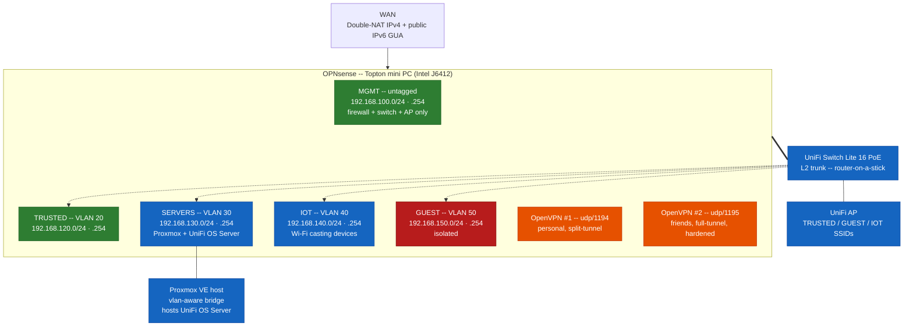

### 🔧 Home-Lab v2 — Segmented OPNsense Build

**A dedicated bare-metal firewall replacing v1's virtualized-Sophos-on-Proxmox design.** Real VLAN segmentation across trust levels, a self-hosted UniFi controller managing a real switch and AP, a Proxmox host living behind the firewall as just another segment, and a dual-purpose OpenVPN egress. This document is a living record, updated as the build progresses — not a retrospective like v1.

---

## Table of Contents

1. [Status](#-status)
2. [Overview](#-overview)
3. [Goals](#-goals)
4. [Network topology](#️-network-topology)
5. [Hardware and software inventory](#-hardware-and-software-inventory)
6. [Configuration highlights](#️-configuration-highlights)
7. [Known issues & lessons](#-known-issues--lessons)
8. [Planned / not yet built](#-planned--not-yet-built)
9. [Related documentation](#-related-documentation)
10. [Keywords](#-keywords)
11. [Contributions](#-contributions)
12. [License](#-license)

---

## 📌 Status

🚧 **Active, in progress.** Build started August 2026. Firewall, full VLAN segmentation (TRUSTED / SERVERS / GUEST / IOT), switch and AP adoption with VLAN-aware port profiles, and the Proxmox host are all live. The self-hosted UniFi controller has been migrated from the classic UniFi Network Application to the newer self-hosted **UniFi OS Server**. NAS is still planned, not yet deployed.

<a href="#table-of-contents">↑ Back to Table of Contents</a>

---

## 🔧 Overview

Where v1 ran its firewall as a VM inside a general-purpose hypervisor, v2 inverts that: a dedicated bare-metal appliance (OPNsense) sits at the edge, with virtualization (Proxmox) living *behind* it as just another segment on the network — not the thing hosting the firewall itself. Proxmox now hosts the self-hosted UniFi controller that manages the physical switch and AP, and the design continues to scale as more physical devices join, each with a clear, narrow role, rather than one box doing everything.

<a href="#table-of-contents">↑ Back to Table of Contents</a>

---

## 🎯 Goals

- **Dedicated edge hardware** — a purpose-built firewall appliance, not a VM competing for hypervisor resources.
- **Real network segmentation** — VLANs with distinct trust levels (management, trusted clients, servers, IoT, guest), not a flat LAN.
- **Defense in depth on egress** — GeoIP blocking, IDS/IPS, reputation-based blocklists, and DNS-bypass prevention, applied consistently across every segment.
- **Responsible shared VPN egress** — a friends-facing VPN exit hardened against the specific category of traffic that creates real legal exposure for the account holder, without being a blanket content filter.
- **Compute and storage as separate concerns** — Proxmox for services, a dedicated NAS for bulk/media storage, connected over the network rather than crammed into one box.
- **Management plane stays management-only** — the untagged native segment is reserved for the firewall, switch, and AP; compute workloads (Proxmox and everything on it) live on their own tagged VLAN, not mixed into the one segment meant to stay untouched during VLAN work.
- **Operate like production, not like a hobby project** — config backups with rollback anchors before every change, verification against the live system rather than trusting exported config files, and a documented gotchas list so mistakes aren't repeated.

<a href="#table-of-contents">↑ Back to Table of Contents</a>

---

## 🗺️ Network topology

| Interface              | Role                                 | Address                                                                 | Notes                                                                                                                                          |
| ----------------------- | ------------------------------------- | ------------------------------------------------------------------------ | ------------------------------------------------------------------------------------------------------------------------------------------------ |
| WAN                     | Internet                              | Static IPv4 behind double-NAT (ISP router) + public IPv6 GUA via DHCPv6 | The double-NAT doesn't shield IPv6 — WAN has a real routable IPv6 address.                                                                     |
| MGMT (native/untagged)  | Management                            | 192.168.100.0/24, gateway `.254`                                        | Deliberately reserved for OPNsense itself, the switch, and the AP only — nothing else lives here, keeping this the one segment a VLAN mistake elsewhere can never strand. |
| TRUSTED (VLAN 20)       | Day-to-day devices, internal Wi-Fi    | 192.168.120.0/24, gateway `.254`                                        |                                                                                                                                                  |
| SERVERS (VLAN 30)       | Proxmox host + guests                 | 192.168.130.0/24, gateway `.254`                                        | Proxmox host `.253`; self-hosted UniFi OS Server LXC `.201`. Full bidirectional access to/from TRUSTED for home-lab convenience.               |
| IOT (VLAN 40)           | Wi-Fi casting devices (smart TV, etc.) | 192.168.140.0/24, gateway `.254`                                        | One-directional Pass rules from TRUSTED and GUEST only — no return path needed thanks to stateful connection tracking. mDNS/SSDP reflected in from both. |
| GUEST (VLAN 50)         | Guest devices, isolated               | 192.168.150.0/24, gateway `.254`                                        | Explicit isolation rule blocks all RFC1918 destinations except IOT (for casting); internet-only otherwise.                                     |

**Switch:** Ubiquiti UniFi Switch Lite 16 PoE — layer 2 only; all inter-VLAN routing happens on OPNsense (router-on-a-stick over a single trunk). Adopted via a self-hosted UniFi controller, with dedicated port profiles: `AP-Trunk` (uplink to the AP, tagged TRUSTED/GUEST/IOT), `Uplink-Trunk` (to OPNsense, allow-all), `Proxmox-Trunk` (to the Proxmox host, tagged SERVERS), and `Trusted-Access` (edge ports for wired clients, native VLAN TRUSTED).

**AP:** Ubiquiti U7 Lite, broadcasting three SSIDs bound to their respective VLANs: the primary trusted network, an isolated guest network, and `IoT` for Wi-Fi casting devices.

**DNS/DHCP:** split design — Unbound handles recursive resolution, DNSSEC, and DNSBL-based content filtering; Dnsmasq handles DHCP and authoritative local DNS (`lab.lan`). Each VLAN interface needs its own DHCP range *and* its own entry in both Unbound's and Dnsmasq's listener interface lists — the most common way a segmented network looks "broken" when it's actually just a missed checkbox, and it bit this build twice during the IOT rollout before becoming a checked-first habit.

**mDNS/SSDP reflection:** the `os-mdns-repeater` plugin reflects multicast discovery traffic between TRUSTED, GUEST, and IOT — without it, casting-capable devices on IOT are invisible to senders on other VLANs even with the right firewall Pass rules in place, since multicast doesn't cross subnet boundaries on its own.

**VPN:** two OpenVPN instances share one CA and one tls-crypt key:

- **Instance 1** (udp/1194) — personal remote access, split-tunnel, routes to TRUSTED and SERVERS (not GUEST).
- **Instance 2** (udp/1195) — full-tunnel internet exit for friends/family, hardened (see [Configuration highlights](#️-configuration-highlights)).

<a href="#table-of-contents">↑ Back to Table of Contents</a>

---

## 🧾 Hardware and software inventory

**Deployed**

*Hardware*

- Topton mini PC — Intel J6412, 4× Intel i226-V NICs (OPNsense).
- Ubiquiti Switch Lite 16 PoE — adopted, VLAN-aware port profiles live.
- Ubiquiti U7 Lite AP — adopted, three SSIDs live.
- HP EliteDesk Mini 600 G6 (i5-10500T) — Proxmox VE host, ZFS root, living on SERVERS VLAN 30.

*Software*

- OPNsense 26.7.1, FreeBSD 15.1, ZFS root.
- Proxmox VE 7.x, ZFS local storage.
- **UniFi OS Server** — self-hosted, Podman-based, running inside a privileged LXC (`CT 201`, `unifi-os`). Migrated from an earlier self-hosted UniFi Network Application deployment (Docker-based, `CT 200`, since destroyed) — full migration story, including the LXC/kernel troubleshooting it took to get there, in [`unifi.md`](unifi.md).
- `os-mdns-repeater` — OPNsense plugin reflecting mDNS/SSDP between VLANs for cross-segment device discovery.

**Planned** — build order: NAS next

*Hardware*

- 2–4 bay NAS, RAID10, starting with 4× 1TB HDDs.
- A third bay (HP caddy kit) reserved for a local Proxmox Backup Server datastore — Tier-1 backup, fast local restore; the NAS becomes Tier-2 (off-box) once built.

*Software*

- Media server (Jellyfin or similar) — storage on NAS via NFS, app on Proxmox.
- Central reverse proxy + a dedicated DMZ/PUBLIC VLAN for anything eventually exposed to the internet.
- Anything else that emerges — deliberately left open rather than over-planned.

<a href="#table-of-contents">↑ Back to Table of Contents</a>

---

## ⚙️ Configuration highlights

- **Firewall rule consolidation via multi-interface + alias-based scoping.** Rules shared by TRUSTED and SERVERS are written once against both interfaces, using a purpose-built alias (`internal_vlans`) for inverted-destination matching where OPNsense's GUI won't allow inverting against multiple discrete targets directly. GUEST is deliberately excluded from every shared rule and kept on its own, fully separate, order-dependent rule set.
- **GUEST isolation, in enforced order:** pass DNS/NTP to the gateway → pass to IOT (casting only) → block all further access to the firewall itself → block all RFC1918 destinations (`private_nets_VPN_ADD`, which conveniently already covers every other VLAN plus both VPN tunnel subnets) → pass-any (internet only) last. OPNsense's GUI rules are evaluated top-to-bottom, first match wins (`quick` is implicit) — order is the whole ballgame here, not just a cosmetic list.
- **IOT access is one-directional by design, not by oversight.** TRUSTED→IOT and GUEST→IOT each get a single Pass rule; there's no matching IOT→TRUSTED/GUEST rule, and none is needed — OPNsense's stateful firewall automatically permits reply traffic for a connection TRUSTED/GUEST initiated. Adding a return-path rule would only be useful (and would only be added) if IOT devices needed to initiate unsolicited connections inward, which they don't.
- **GeoIP blocking** of a defined hostile-country list, verified live to sit ahead of both OpenVPN port passes in the actual pf ruleset — not just assumed from the GUI.
- **Responsible VPN egress hardening (Instance 2 / friends' VPN):** DNS forced through CleanBrowsing's *Security Filter* (malware/phishing/CSAM blocking only — deliberately not a lifestyle/content filter, since general adult content and torrenting are explicitly permitted), plus a firewall block against an auto-updating alias of official Tor Project exit-node IPs, refreshed daily. The goal is narrow: block the one category that creates real legal exposure for the account holder, without restricting anything else.
- **Proxmox networking: one vlan-aware bridge doing two jobs.** `vmbr0` runs with `bridge-vlan-aware yes`, letting individual LXC guests get tagged directly onto whichever VLAN they belong to (`tag=30` in a container's `net0` line) — while the Proxmox host's *own* management IP rides a dedicated 802.1Q sub-interface (`vmbr0.30`) on the same bridge. One physical trunk port, two different VLAN-membership mechanisms, coexisting cleanly. Full reasoning in [`proxmox.md`](proxmox.md).
- **UniFi went self-hosted twice.** First as a Docker Compose stack (UniFi Network Application), then migrated to Ubiquiti's newer, officially self-hosted **UniFi OS Server** — which is Podman-only (not Docker) and, as deployed here, runs inside a privileged LXC. Getting there took real kernel/container-runtime troubleshooting — full story in [`unifi.md`](unifi.md).
- **Standing operational discipline:** every live network change gets a full config backup before touching anything, console/out-of-band access confirmed available before any change that could drop the current session, and claims about running state verified against the live system rather than trusted from an exported config file.

<a href="#table-of-contents">↑ Back to Table of Contents</a>

---

## 🐛 Known issues & lessons

Real gotchas discovered while building this, not sanitized after the fact:

- **Multi-interface + multi-source floating rules expand into a full cross-product.** Selecting three interfaces *and* three source networks on one rule doesn't produce "one rule per interface matching its own network" — OPNsense generates a rule for *every* interface/source-network combination, including nonsensical ones. Harmless in practice (auto-generated anti-spoofing rules already drop any packet claiming the wrong subnet on the wrong interface), but it inflates the ruleset enormously for no functional benefit. Fix: use `any` for Source when interface scoping already does the real work.
- **A rule can look "floating" by description and behave normally by schema.** A rule intended as a floating, always-first GeoIP block showed no floating attribute anywhere in the exported config — just a normal WAN-interface rule at a given sequence. It still evaluated correctly live (confirmed via `pfctl -sr`), but config.xml alone couldn't have confirmed that; only the live ruleset could.
- **dnsmasq and Unbound both self-follow interface IP changes, but not interface *additions*.** Moving an existing interface's address doesn't require updating either service's listener list, since both bind by interface, not a hardcoded address. Adding a brand-new VLAN interface is different — it has to be manually added to both services' interface lists, or that VLAN gets no DHCP and no DNS at all, which looks exactly like "the network is broken" rather than "one checkbox was missed."
- **A privileged LXC still isn't the same as the host.** Converting an *existing* unprivileged container to privileged doesn't retroactively fix on-disk file ownership — the whole rootfs stays shifted by the old subuid offset, silently breaking setuid binaries like `su`. The fix is a fresh container built privileged from creation, not a flag flip on an old one. Full story in [`unifi.md`](unifi.md).
- **A kernel-level restriction can hide behind three layers of tooling.** A single failing sysctl write surfaced first as a Proxmox config-parser rejection, then as a silent container-boot failure, before `lxc-start -F -l DEBUG` finally showed the real, one-line kernel error underneath. Each layer's own error message was accurate but incomplete on its own.
- **"Other Types" doesn't exist in this OPNsense version's menu** the way older documentation describes — VLAN interface creation lives under **Interfaces → Devices → VLAN**, not a dedicated top-level menu item.
- **UniFi switches have no standalone local management.** Factory/unadopted state is a plain unmanaged L2 switch (everything on the native VLAN); VLAN-aware port profiles require a UniFi controller to exist and adopt the device first. This is architecture, not a missing feature.
- **PoE port layout isn't odd/even** on the UniFi Switch Lite 16 PoE — it's a straight split, ports 1–8 PoE+, 9–16 non-PoE. Moot in practice, since PoE only activates on negotiation, so any port is safe for a non-PoE uplink.

<a href="#table-of-contents">↑ Back to Table of Contents</a>

---

## 🧭 Planned / not yet built

- NAS (2–4 bay, RAID10).
- Local Proxmox Backup Server datastore (Tier-1 backup) once the NAS's freed-up bay is available.
- Dedicated DMZ/PUBLIC VLAN + central reverse proxy for anything eventually exposed to the internet.
- Suricata IPS scope decision — currently `lan,opt1,wan` only. Now that inter-VLAN routing carries real traffic across four segments, all of it will hairpin through Suricata on modest hardware if scope expands, so WAN-only vs. all-interfaces remains an open tradeoff to make deliberately, not by default.
- OpenVPN tls-crypt key rotation — flagged as compromised after appearing unredacted in an exported config during a review pass. Deferred since the VPN isn't currently in active use; revisit before either instance goes back into use.

<a href="#table-of-contents">↑ Back to Table of Contents</a>

---

## 🔗 Related documentation

| Doc              | Covers                                                                       | Status     |
| ----------------- | ------------------------------------------------------------------------------ | ----------- |
| [`opnsense.md`](opnsense.md) | Firewall build in full: interfaces, VLANs, firewall rules, aliases, DNS/DHCP. | ✅ Written  |
| [`unifi.md`](unifi.md)    | Switch/AP adoption, port profiles, SSIDs, and the full Network Application → OS Server migration. | ✅ Written  |
| [`proxmox.md`](proxmox.md) | Hypervisor storage, VM/LXC strategy, VLAN-aware networking, backup design.    | ✅ Written  |
| `configs/`        | Real config excerpts, secrets redacted.                                        | 📝 To be added |

<a href="#table-of-contents">↑ Back to Table of Contents</a>

---

## 🔑 Keywords

`OPNsense` · `VLAN segmentation` · `pfctl` · `UniFi` · `UniFi OS Server` · `Podman` · `Proxmox` · `ZFS` · `LXC` · `mDNS` · `SSDP` · `homelab` · `network security` · `GeoIP` · `CrowdSec` · `Suricata` · `OpenVPN` · `firewall` · `self-hosted` · `infrastructure engineering`

<a href="#table-of-contents">↑ Back to Table of Contents</a>

---

## 🤝 Contributions

This repository is personal and experience-driven, but feedback and ideas are welcome. If you've faced similar challenges, feel free to share your approach or suggest improvements.

- 💼 [LinkedIn](https://linkedin.com/in/fameri)
- 🌐 [GitHub](https://github.com/francoameri)
- ✉️ <famerisbraccia@gmail.com>

<a href="#table-of-contents">↑ Back to Table of Contents</a>

---

## 📝 License

All content in this repository is shared under the **Creative Commons Attribution 4.0 International License (CC BY 4.0)**.

You are free to:

- **Share** — copy and redistribute the material in any medium or format
- **Adapt** — remix, transform, and build upon the material for any purpose, even commercially

Under the following terms:

- **Attribution** — give appropriate credit to **Franco [francoameri]** as the original author, provide a link to this repository, and indicate if changes were made.

🔗 Full license text: [LICENSE.md](https://github.com/francoameri/francoameri/blob/main/LICENSE.md)

<a href="#table-of-contents">↑ Back to Table of Contents</a>

