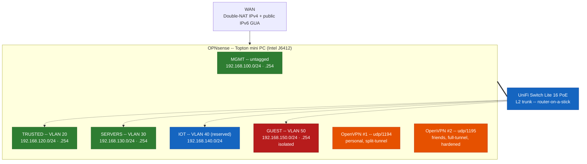

### 🔧 Home-Lab v2 — Segmented OPNsense Build

**A dedicated bare-metal firewall replacing v1's virtualized-Sophos-on-Proxmox design.**
Real VLAN segmentation across trust levels, dual-purpose OpenVPN egress, and a Proxmox host + NAS arriving next. This document is a living record, updated as the build progresses — not a retrospective like v1.

---

## Table of Contents

1. [Status](#-status)
2. [Overview](#-overview)
3. [Goals](#-goals)
4. [Network topology](#️-network-topology)
5. [Hardware and software inventory](#-hardware-and-software-inventory)
6. [Configuration highlights](#️-configuration-highlights)
7. [Known issues & lessons](#-known-issues--lessons)
8. [Planned / not yet built](#-planned--not-yet-built)
9. [Related documentation](#-related-documentation)
10. [Keywords](#-keywords)
11. [Contributions](#-contributions)
12. [License](#-license)

---

## 📌 Status

🚧 **Active, in progress.** Build started August 2026. Firewall, VLAN segmentation, and switch are live; Proxmox host and NAS are planned, not yet deployed.

<a href="#table-of-contents">↑ Back to Table of Contents</a>

---

## 🔧 Overview

Where v1 ran its firewall as a VM inside a general-purpose hypervisor, v2 inverts that: a dedicated bare-metal appliance (OPNsense) sits at the edge, with virtualization (Proxmox, arriving next) living *behind* it as just another segment on the network — not the thing hosting the firewall itself. The goal is a design that scales cleanly as more physical devices join — switch, access point, NAS, compute host — each with a clear, narrow role, rather than one box doing everything.

<a href="#table-of-contents">↑ Back to Table of Contents</a>

---

## 🎯 Goals

- **Dedicated edge hardware** — a purpose-built firewall appliance, not a VM competing for hypervisor resources.
- **Real network segmentation** — VLANs with distinct trust levels (management, trusted clients, servers, guest), not a flat LAN.
- **Defense in depth on egress** — GeoIP blocking, IDS/IPS, reputation-based blocklists, and DNS-bypass prevention, applied consistently across every segment.
- **Responsible shared VPN egress** — a friends-facing VPN exit hardened against the specific category of traffic that creates real legal exposure for the account holder, without being a blanket content filter.
- **Compute and storage as separate concerns** — Proxmox for services, a dedicated NAS for bulk/media storage, connected over the network rather than crammed into one box.
- **Operate like production, not like a hobby project** — config backups with rollback anchors before every change, verification against the live system rather than trusting exported config files, and a documented gotchas list so mistakes aren't repeated.

<a href="#table-of-contents">↑ Back to Table of Contents</a>

---

## 🗺️ Network topology

| Interface | Role | Address | Notes |
|---|---|---|---|
| WAN | Internet | Static IPv4 behind double-NAT (ISP router) + public IPv6 GUA via DHCPv6 | The double-NAT doesn't shield IPv6 — WAN has a real routable IPv6 address. |
| MGMT (native/untagged) | Management | 192.168.100.0/24, gateway `.254` | Stays untagged on the trunk deliberately — the one segment never touched during VLAN work, so a mistake elsewhere can't strand admin access. |
| TRUSTED (VLAN 20) | Day-to-day devices, internal Wi-Fi | 192.168.120.0/24, gateway `.254` | |
| SERVERS (VLAN 30) | Proxmox host and VMs (planned) | 192.168.130.0/24, gateway `.254` | |
| GUEST (VLAN 50) | Guest devices, isolated | 192.168.150.0/24, gateway `.254` | Explicit isolation rule blocks all RFC1918 destinations; internet-only. |
| IOT (VLAN 40) | Reserved | 192.168.140.0/24 | Address space reserved, not yet built. |

**Switch:** Ubiquiti UniFi Switch Lite 16 PoE — layer 2 only; all inter-VLAN routing happens on OPNsense (router-on-a-stick over a single trunk). Currently connected and passing traffic on the flat/native network, pending UniFi Network Application deployment for VLAN-aware port profiles.

**DNS/DHCP:** split design — Unbound handles recursive resolution, DNSSEC, and DNSBL; dnsmasq handles DHCP and authoritative local DNS (`lab.lan`) on a non-standard port; an Unbound domain override ties the two together. Each VLAN interface needs its own DHCP range *and* its own entry in Unbound's listener list — a VLAN with an IP but no DNS resolution is the most common way a segmented network looks "broken" when it's actually just a missed checkbox.

**VPN:** two OpenVPN instances share one CA and one tls-crypt key:
- **Instance 1** (udp/1194) — personal remote access, split-tunnel, routes to TRUSTED and SERVERS (not GUEST).
- **Instance 2** (udp/1195) — full-tunnel internet exit for friends/family, hardened (see [Configuration highlights](#️-configuration-highlights)).

<a href="#table-of-contents">↑ Back to Table of Contents</a>

---

## 🧾 Hardware and software inventory

**Deployed**

*Hardware*
- Topton mini PC — Intel J6412, 4× Intel i226-V NICs.
- Ubiquiti Switch Lite 16 PoE — 8 of 16 ports PoE+, awaiting controller adoption.

*Software*
- OPNsense 26.7.1, FreeBSD 15.1, ZFS root.

**Planned** — build order: firewall/VLANs → switch/AP adoption → Proxmox → NAS

*Hardware*
- HP EliteDesk Mini 600 G6 (i5-10500T, 16→32GB RAM planned) — Proxmox VE host. Boot/VM storage: ZFS mirror across two 512GB NVMes (replacing a single 256GB drive, freed for reuse). A third bay (HP caddy kit) reserved for a local Proxmox Backup Server datastore — Tier-1 backup, fast local restore; the NAS becomes Tier-2 (off-box) once built.
- 2–4 bay NAS, RAID10, starting with 4× 1TB HDDs — expected within ~2 months.
- UniFi AP — purchased, not yet installed.

*Software*
- UniFi Network Application — self-hosted, free, Docker-based, to be deployed as one of the first Proxmox guests (needed to adopt both the switch and the future AP).
- Media server (Jellyfin or similar) — storage on NAS via NFS, app on Proxmox.
- Anything else that emerges — deliberately left open rather than over-planned.

<a href="#table-of-contents">↑ Back to Table of Contents</a>

---

## ⚙️ Configuration highlights

- **Firewall rule consolidation via multi-interface + alias-based scoping.** Rules shared by TRUSTED and SERVERS are written once against both interfaces, using a purpose-built alias (`internal_vlans`) for inverted-destination matching where OPNsense's GUI won't allow inverting against multiple discrete targets directly. GUEST is deliberately excluded from every shared rule and kept on its own, fully separate, order-dependent rule set — mixing it into shared rules would risk its isolation logic becoming unclear or bypassed.
- **GUEST isolation, in enforced order:** pass DNS/NTP to the gateway → block all further access to the firewall itself → block all RFC1918 destinations (`private_nets_VPN_ADD`, which conveniently already covers every other VLAN plus both VPN tunnel subnets) → pass-any (internet only) last.
- **GeoIP blocking** of a defined hostile-country list, verified live to sit ahead of both OpenVPN port passes in the actual pf ruleset — not just assumed from the GUI.
- **Responsible VPN egress hardening (Instance 2 / friends' VPN):** DNS forced through CleanBrowsing's *Security Filter* (malware/phishing/CSAM blocking only — deliberately not a lifestyle/content filter, since general adult content and torrenting are explicitly permitted), plus a firewall block against an auto-updating alias of official Tor Project exit-node IPs (`https://check.torproject.org/torbulkexitlist`, refreshed daily). The goal is narrow: block the one category that creates real legal exposure for the account holder, without restricting anything else.
- **Standing operational discipline:** every live change gets a ZFS-boot-environment rollback anchor (`bectl create`) and a config backup *before* the change. Claims about firewall/DNS/service behavior are verified against the running system (`pfctl`, `sockstat`, `drill`) rather than trusted from an exported config file.

<a href="#table-of-contents">↑ Back to Table of Contents</a>

---

## 🐛 Known issues & lessons

Real gotchas discovered while building this, not sanitized after the fact:

- **Multi-interface + multi-source floating rules expand into a full cross-product.** Selecting three interfaces *and* three source networks on one rule doesn't produce "one rule per interface matching its own network" — OPNsense generates a rule for *every* interface/source-network combination, including nonsensical ones (e.g., a rule on the TRUSTED interface matching GUEST's source subnet). Harmless in practice, since auto-generated anti-spoofing rules already drop any packet claiming the wrong subnet on the wrong interface — but it inflates the ruleset enormously (one rule became 270+ lines of pf output) for no functional benefit. Fix: use `any` for Source when interface scoping already does the real work; let anti-spoofing handle the rest.
- **A rule can look "floating" by description and behave normally by schema.** A rule intended as a floating, always-first GeoIP block showed no floating attribute anywhere in the exported config — just a normal WAN-interface rule at a given sequence. It still evaluated correctly live (confirmed via `pfctl -sr`), but config.xml alone couldn't have confirmed that; only the live ruleset could.
- **dnsmasq and Unbound both self-follow interface IP changes.** Moving an interface's address doesn't require manually updating either service's listen-address list, since both bind by interface, not a hardcoded address. What *does* need a manual nudge: an already-running service instance holding a stale socket on the old address until it's restarted/reloaded — `sockstat` shows the ghost binding until then.
- **A client machine's own DHCP lease doesn't self-heal** when the gateway address changes underneath it — the client keeps routing through the old (now-nonexistent) gateway/DNS server until its lease renews. Same-subnet SSH access to the new address still works immediately regardless (ARP, not routing), but broader connectivity needs a manual release/renew.
- **"Other Types" doesn't exist in this OPNsense version's menu** the way older documentation describes — VLAN interface creation lives under **Interfaces → Devices → VLAN**, not a dedicated top-level menu item.
- **UniFi switches have no standalone local management.** Factory/unadopted state is a plain unmanaged L2 switch (everything on the native VLAN); VLAN-aware port profiles require the UniFi Network Application to exist and adopt the device first. This is architecture, not a missing feature.
- **PoE port layout isn't odd/even** on the UniFi Switch Lite 16 PoE — it's a straight split, ports 1–8 PoE+, 9–16 non-PoE. Moot in practice, since PoE only activates on negotiation, so any port is safe for a non-PoE uplink.

<a href="#table-of-contents">↑ Back to Table of Contents</a>

---

## 🧭 Planned / not yet built

- Proxmox VE host (RAM upgrade, ZFS mirror, local PBS backup target).
- NAS (2–4 bay, RAID10, ~2 months out).
- UniFi Network Application (self-hosted, Docker) — required to adopt the switch and AP and to actually apply VLAN-aware port profiles.
- UniFi AP adoption.
- Suricata IPS scope decision — currently `lan,opt1,wan` only. Once inter-VLAN routing carries real traffic, all of it will hairpin through Suricata on modest hardware, so WAN-only vs. all-interfaces is an open tradeoff to make deliberately, not by default.
- OpenVPN tls-crypt key rotation — flagged as compromised after appearing unredacted in an exported config during a review pass. Deferred since the VPN isn't currently in active use; revisit before either instance goes back into use.

<a href="#table-of-contents">↑ Back to Table of Contents</a>

---

## 🔗 Related documentation

| Doc | Covers | Status |
|---|---|---|
| `opnsense.md` | Firewall build in full: interfaces, VLANs, firewall rules, aliases. | 📝 To be written |
| `unifi.md` | Switch/AP adoption and port profiles, once built. | 📝 To be written |
| `proxmox.md` | Hypervisor storage, VM/LXC strategy, backup design, once built. | 📝 To be written |
| `configs/` | Real config excerpts, secrets redacted. | 📝 To be added |

<a href="#table-of-contents">↑ Back to Table of Contents</a>

---

## 🔑 Keywords

`OPNsense` · `VLAN segmentation` · `pfctl` · `UniFi` · `Proxmox` · `ZFS` · `homelab` · `network security` · `GeoIP` · `CrowdSec` · `Suricata` · `OpenVPN` · `firewall` · `self-hosted` · `infrastructure engineering`

<a href="#table-of-contents">↑ Back to Table of Contents</a>

---

## 🤝 Contributions

This repository is personal and experience-driven, but feedback and ideas are welcome. If you've faced similar challenges, feel free to share your approach or suggest improvements.

- 💼 [LinkedIn](https://linkedin.com/in/fameri)
- 🌐 [GitHub](https://github.com/francoameri)
- ✉️ famerisbraccia@gmail.com

<a href="#table-of-contents">↑ Back to Table of Contents</a>

---

## 📝 License

All content in this repository is shared under the **Creative Commons Attribution 4.0 International License (CC BY 4.0)**.

You are free to:
- **Share** — copy and redistribute the material in any medium or format
- **Adapt** — remix, transform, and build upon the material for any purpose, even commercially

Under the following terms:
- **Attribution** — give appropriate credit to **Franco [francoameri]** as the original author, provide a link to this repository, and indicate if changes were made.

🔗 Full license text: [LICENSE.md](https://github.com/francoameri/francoameri/blob/main/LICENSE.md)

<a href="#table-of-contents">↑ Back to Table of Contents</a>

