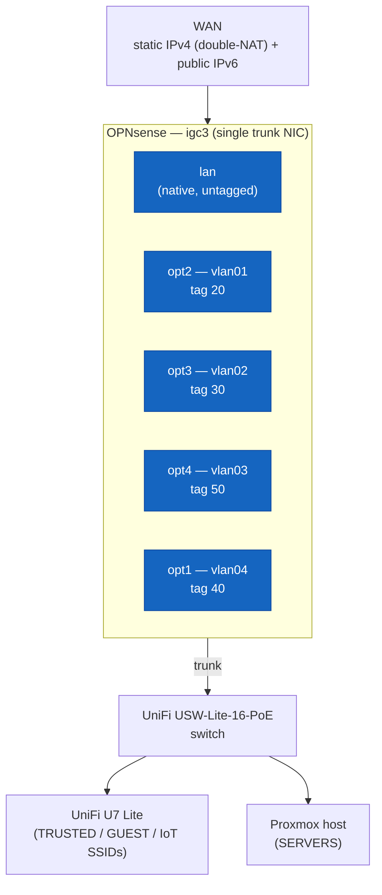

# 🛡️ OPNsense — Firewall Build in Full

Interfaces, VLANs, DNS/DHCP, firewall rules, and the filtering/reflection services layered on top. Links to other v2 docs point directly at the relevant heading — there's no numbered `§N` citation scheme, just plain markdown links.

---

## Table of Contents

1. [Interfaces and VLANs](#interfaces-and-vlans)
2. [DNS and DHCP — a split design](#dns-and-dhcp--a-split-design)
3. [Content filtering](#content-filtering)
4. [Firewall rule architecture](#firewall-rule-architecture)
5. [GeoIP blocking](#geoip-blocking)
6. [mDNS/SSDP reflection](#mdnsssdp-reflection)
7. [VPN](#vpn)
8. [Monitoring API access](#monitoring-api-access)
9. [Known issues & lessons](#known-issues--lessons)

---

## Interfaces and VLANs

One physical LAN NIC (`igc3`) carries four tagged VLANs plus the native/untagged segment, all router-on-a-stick through OPNsense to the switch's trunk port:



| VLAN device | Tag | Interface identifier | Description |
| ------------ | ---- | ---------------------- | ------------- |
| — (native)  | —   | `lan`                 | MGMT — firewall/switch/AP only |
| `vlan01`    | 20  | `opt2` (TRUSTED)      | Day-to-day devices |
| `vlan02`    | 30  | `opt3` (SERVERS)      | Proxmox + guests |
| `vlan03`    | 50  | `opt4` (GUEST)        | Isolated guest devices |
| `vlan04`    | 40  | `opt1` (IOT)          | Wi-Fi casting devices |

Each VLAN interface gets a static gateway address at `.254` on its own `/24`, `IPv4 gateway rules: Disabled` (OPNsense is the gateway for its own interfaces, not routing through another one).

VLAN device creation lives under **Interfaces → Devices → VLAN** in this OPNsense version — older documentation referencing an "Other Types" menu doesn't match the current UI. After creating the raw VLAN device, it still needs a separate step under **Interfaces → Assignments** to actually become a usable interface (`optN`) — creating the VLAN device alone isn't sufficient.

<div align="right"><sub><a href="#table-of-contents">↑ Back to Table of Contents</a></sub></div>

---

## DNS and DHCP — a split design

Unbound handles recursive resolution, DNSSEC, and DNSBL-based content filtering. Dnsmasq handles DHCP and authoritative local DNS (`lab.lan`) on a non-standard port, with an Unbound domain override tying the two together so both static infrastructure and dynamic DHCP clients resolve consistently by hostname.

The one rule that matters most operationally: **every VLAN interface needs its own DHCP range in Dnsmasq, and its own entry in both Dnsmasq's and Unbound's listener interface lists.** Neither service auto-discovers newly added interfaces — a VLAN can have a perfectly good IP scheme and gateway, and still hand out no DHCP leases and no DNS resolution at all, because one checkbox in a settings page was missed. This exact gap showed up twice during this build (once for the original TRUSTED/SERVERS/GUEST rollout, once for IOT), and is now a checked-first step any time a new VLAN is added rather than something discovered by debugging "why does this VLAN look broken."

### DNS redundancy: Pi-hole primary, Unbound secondary

Pi-hole ([`pihole.md`](pihole.md)) is now the primary DNS resolver advertised to every VLAN, sitting in front of this firewall's own Unbound. Since Pi-hole runs as a single container on Proxmox, it's a real single point of failure for name resolution network-wide if left as the only advertised resolver — a Proxmox host, storage, or container failure would take down DNS for every VLAN, not just ad-blocking.

Each VLAN's DHCP option 6 (`dns-server`) now advertises Pi-hole first and that VLAN's own OPNsense gateway (running Unbound) second, comma-separated:

```
# Dnsmasq DHCP option 6, per VLAN — Pi-hole primary, Unbound (this firewall) secondary
TRUSTED:  dhcp-option=tag:TRUSTED,6,192.168.130.200,192.168.120.254
GUEST:    dhcp-option=tag:GUEST,6,192.168.130.200,192.168.150.254
IOT:      dhcp-option=tag:IOT,6,192.168.130.200,192.168.140.254
SERVERS:  dhcp-option=tag:SERVERS,6,192.168.130.200,192.168.130.254
```

(Configured through the OPNsense GUI's DHCP options fields, not a hand-edited dnsmasq.conf — shown here as the equivalent config line for clarity.)

If Pi-hole is unreachable, clients fall back to this firewall's Unbound instance — full DNS resolution keeps working, just without Pi-hole's ad/tracker blocking, rather than the network losing DNS entirely.

> **Why it matters:** primary/secondary resolver failover via DHCP option 6 is the same mechanism enterprise networks use for resolver redundancy — no client-side configuration or health-check logic needed, since the OS network stack already retries the second server in the list on timeout.

<div align="right"><sub><a href="#table-of-contents">↑ Back to Table of Contents</a></sub></div>

---

## Content filtering

Unbound's built-in DNSBL plugin blocks against a combination of general ad/tracker/malware lists (OISD) and a Hagezi category list, intercepting matching domains before they're ever forwarded upstream — independent of whatever upstream resolver is configured. Two DNS-over-TLS forwarders (OpenDNS) sit behind the DNSBL for everything that isn't blocked, providing encrypted upstream resolution; the actual filtering enforcement is the DNSBL layer, not the upstream provider's own category filtering. Pi-hole's own blocklists ([`pihole.md`](pihole.md)) now sit in front of this as the first line of ad/tracker blocking for ordinary client queries; Unbound's DNSBL remains the fallback layer, active whenever a client resolves through Unbound directly (e.g., during a Pi-hole outage, per the redundancy design above).

<div align="right"><sub><a href="#table-of-contents">↑ Back to Table of Contents</a></sub></div>

---

## Firewall rule architecture

OPNsense's GUI-generated rules are evaluated **top-to-bottom with first-match-wins** (`quick` is implicit on every rule the GUI creates) — this is the single most important thing to internalize before writing any rule set here, since it means order is functionally part of the rule, not just presentation. **Floating rules are evaluated before interface rules**, regardless of which interface a floating rule is scoped to — a floating Block rule written for one purpose can silently catch traffic to something built long afterward if its match criteria are broad enough (see [Known issues](#known-issues--lessons)).

**Shared rules, alias-based.** Rules that apply identically to TRUSTED and SERVERS (which have full bidirectional access to each other, a deliberate home-lab convenience decision) are written once per interface using a purpose-built alias (`internal_vlans`) for destination matching, rather than duplicating near-identical rules across interfaces.

> **Why it matters:** alias-based rule consolidation is the same technique used to keep large enterprise rule sets maintainable — one alias update propagates everywhere it's referenced, instead of a change needing to be hunted down and repeated across N duplicated rules.

**GUEST, isolated and kept separate.** GUEST is deliberately excluded from the shared TRUSTED/SERVERS rule set and given its own fully separate, strictly ordered rules, expressed here as pf-style pseudocode for readability (not a literal `pfctl -sr` dump):

```
# GUEST interface, top-to-bottom, first-match-wins
pass  in on $GUEST proto {udp} from $GUEST_NET to $GUEST_ADDRESS port {53, 123}   # DNS/NTP to gateway
pass  in on $GUEST                from $GUEST_NET to $IOT_NET                     # casting only
block in on $GUEST                from $GUEST_NET to $GUEST_ADDRESS               # no further access to firewall
block in on $GUEST                from $GUEST_NET to $PRIVATE_NETS_VPN_ADD        # no RFC1918 destinations
pass  in on $GUEST                from $GUEST_NET to any                          # internet, last
```

Mixing GUEST into the shared alias-based rule set was deliberately avoided — GUEST's isolation logic needs to stay unambiguous and independently auditable, not entangled with rules that intentionally grant broad access elsewhere.

**IOT access is intentionally one-directional.** TRUSTED→IOT and GUEST→IOT each get exactly one Pass rule; there's no IOT→TRUSTED or IOT→GUEST equivalent, and none is needed. OPNsense's firewall is stateful — once TRUSTED or GUEST initiates a connection to IOT, the reply traffic for that specific connection is automatically permitted back through the state table, without a separate rule. A return-path rule would only make sense if IOT devices needed to *initiate* new, unsolicited connections into TRUSTED/GUEST, which is deliberately not the design here.

**IOT's own ruleset.** IOT originally had only the *inbound* casting Pass rules that TRUSTED and GUEST point at it — it had no ruleset of its own, which meant IOT devices had no DNS, no NTP, and no outbound internet access at all. This went unnoticed until an actual device (a smart TV, joined to the `IoT` SSID) tested with no internet connectivity. Fixed by cloning GUEST's rule pattern onto the IOT interface directly, adjusted for IOT's own addressing:

```
# IOT interface, top-to-bottom, first-match-wins
pass  in on $IOT proto udp from $IOT_NET to $IOT_ADDRESS port 53    # DNS to gateway
pass  in on $IOT proto udp from $IOT_NET to $IOT_ADDRESS port 123   # NTP to gateway
pass  in on $IOT proto udp from $IOT_NET to 192.168.130.200 port 53 # DNS to Pi-hole directly
block in on $IOT             from $IOT_NET to $IOT_ADDRESS          # no further access to firewall
block in on $IOT             from $IOT_NET to $PRIVATE_NETS_VPN_ADD # no RFC1918 destinations
pass  in on $IOT             from $IOT_NET to any                   # internet, last
```

The one correction needed while building this: rules 1–2 must target **the interface's address** (the gateway itself), not **the interface's network** (the whole `/24`) — cloning a rule from GUEST carries over whichever of the two GUEST happened to use, and the two are easy to conflate since both appear as similarly-named dropdown entries.

<div align="right"><sub><a href="#table-of-contents">↑ Back to Table of Contents</a></sub></div>

---

## GeoIP blocking

A defined hostile-country IP list is blocked ahead of both OpenVPN port passes — verified directly against the live `pfctl -sr` ruleset rather than assumed from the GUI's rule listing, since a rule's on-screen "floating" appearance doesn't always match how it's actually stored or evaluated (see [Known issues](#known-issues--lessons)).

<div align="right"><sub><a href="#table-of-contents">↑ Back to Table of Contents</a></sub></div>

---

## mDNS/SSDP reflection

The `os-mdns-repeater` plugin (**Services → mDNS Repeater**) reflects multicast mDNS/SSDP traffic between TRUSTED, GUEST, and IOT — required for cross-VLAN device discovery (e.g., a phone on TRUSTED finding a smart TV on IOT for casting) since multicast doesn't cross subnet boundaries on its own, regardless of how permissive the unicast firewall rules between those VLANs are. This is a simpler, more purpose-built alternative to a general Avahi setup when the only need is reflecting between a small, fixed set of interfaces.

<div align="right"><sub><a href="#table-of-contents">↑ Back to Table of Contents</a></sub></div>

---

## VPN

Two OpenVPN instances share one CA and one tls-crypt key:

- **Instance 1** (udp/1194) — personal remote access, split-tunnel, routes to TRUSTED and SERVERS only.
- **Instance 2** (udp/1195) — full-tunnel internet exit for friends/family, hardened: DNS forced through CleanBrowsing's Security Filter (malware/phishing/CSAM blocking only, deliberately not a general content filter), plus a firewall block against an auto-updating alias of official Tor Project exit-node IPs, refreshed daily. The intent is narrow — block the one traffic category that creates real legal exposure for the account holder, without restricting anything else a guest might legitimately want to do.

<div align="right"><sub><a href="#table-of-contents">↑ Back to Table of Contents</a></sub></div>

---

## Monitoring API access

The [monitoring stack](monitoring.md) reads live firewall state (ARP tables, gateway status, interface throughput, service status) through OPNsense's own REST API rather than SNMP or log scraping. A dedicated, least-privilege user (`monitoring-api`) was created for this specifically: no password login, no group membership, API key/secret only, scoped to the enumerated set of GUI privileges the exporter's documentation actually requires (Diagnostics: ARP Table, Firewall statistics, Netstat; Reporting: Traffic; Services: Unbound; Status: DNS Overview, IPsec, OpenVPN, Services; System: Firmware, Gateways, Settings: Cron, Status; VPN: OpenVPN Instances, WireGuard; Services: DHCP: Kea v4/v6). One documented privilege, "Status: DHCP leases," doesn't exist in this OPNsense version's privilege list — this install uses Dnsmasq for DHCP, not ISC dhcpd/Kea's DHCP leases view, so that one metric category is permanently empty for this exporter rather than a misconfiguration to keep chasing.

API keys are generated from the Users list's dedicated key icon, not from within the Edit User modal — the modal itself has no API key section.

> **Why it matters:** a single-purpose, no-login, API-key-only service account is the standard pattern for machine-to-machine integrations in production environments — it means a compromised monitoring credential can read ARP tables and gateway stats, and nothing else, rather than inheriting whatever access an interactive admin account would have.

<div align="right"><sub><a href="#table-of-contents">↑ Back to Table of Contents</a></sub></div>

---

## Known issues & lessons

- **Multi-interface + multi-source floating rules expand into a full cross-product**, not "one rule per matching pair." Selecting three interfaces and three source networks on one rule creates a rule for *every* interface/source combination, including nonsensical ones (e.g., a rule on TRUSTED matching GUEST's source subnet). Harmless — auto-generated anti-spoofing rules already drop packets claiming the wrong subnet on the wrong interface — but it inflates the ruleset for no functional benefit. Prefer `any` for Source when interface scoping already does the real work.
- **A rule can look "floating" by description and not be floating by schema.** Only the live ruleset (`pfctl -sr`) confirms actual evaluation order and behavior; the exported config alone can be misleading about a rule's real placement.
- **A pre-existing floating "block DNS bypass" rule can silently break a brand-new service.** A floating rule blocking outbound UDP/53 to anywhere but the firewall itself (written before Pi-hole existed, to force all DNS through Unbound) blocked every cross-VLAN query to the newly deployed Pi-hole, with no obvious error on either side — DNS just silently failed cross-VLAN while working fine from the same subnet (see [Known issues](#known-issues--lessons) in [`pihole.md`](pihole.md) for the full symptom/root-cause trail). Floating Block rules with broad destination match criteria need to be checked whenever a new same-purpose service is added, not just interface rules.
- **The "Invert Destination" checkbox is easy to leave checked when cloning a rule**, and produces the exact opposite of the intended rule — passing traffic to everywhere *except* the intended destination instead of only to it. The rules list renders this as `! <destination>`, which is the tell to look for.
- **System → Settings → Administration → Listen Interfaces scopes more than just the web GUI.** If an interface isn't in that list, connections to the API/GUI on that interface hang with a full TCP-level timeout — indistinguishable from "nothing is listening" — rather than a firewall rejection. This bit the OPNsense exporter entirely (see [`monitoring.md`](monitoring.md)); the fix was adding SERVERS to the list alongside the existing LAN entry, not any firewall rule change.
- **dnsmasq and Unbound both self-follow interface *address* changes, but not interface additions.** A new VLAN needs to be manually added to both services' interface lists — this doesn't happen automatically the way an address change on an existing interface does.
- **A client's own DHCP lease doesn't self-heal when the gateway changes underneath it.** It keeps routing through the old, now-nonexistent gateway/DNS until its lease renews. Same-subnet access to the new address still works immediately (ARP, not routing) regardless.
- **"Other Types" doesn't exist in this OPNsense version's menu** the way older documentation describes — VLAN interface creation lives under **Interfaces → Devices → VLAN**.

<div align="right"><sub><a href="#table-of-contents">↑ Back to Table of Contents</a></sub></div>
