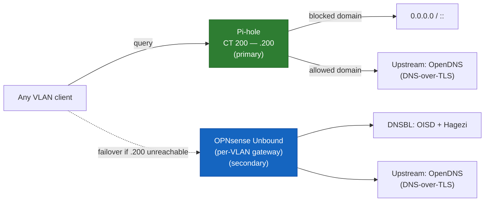

# 🕳️ Pi-hole — Network-Wide DNS and Ad-Blocking

Deployment, the DNS redundancy design it's part of, the floating-rule bug it exposed, and its monitoring integration. Links to [`opnsense.md`](opnsense.md) and [`monitoring.md`](monitoring.md) point directly at the relevant heading — there's no numbered `§N` citation scheme.

---

## Table of Contents

1. [Overview](#overview)
2. [Deployment](#deployment)
3. [DNS redundancy design](#dns-redundancy-design)
4. [The DNS-bypass floating rule bug](#the-dns-bypass-floating-rule-bug)
5. [Monitoring integration](#monitoring-integration)
6. [Known issues & lessons](#known-issues--lessons)

---

## Overview

Pi-hole is the primary DNS resolver for every VLAN — TRUSTED, GUEST, IOT, and SERVERS all resolve through it first, with OPNsense's own Unbound instance ([`opnsense.md`](opnsense.md#dns-and-dhcp--a-split-design)) sitting behind it as a fallback. Its purpose is network-wide ad/tracker blocking at the DNS layer, on top of (not instead of) the recursive resolution, DNSSEC, and DNSBL filtering Unbound already provides.



<div align="right"><sub><a href="#table-of-contents">↑ Back to Table of Contents</a></sub></div>

---

## Deployment

Runs as `CT 200` on Proxmox (SERVERS `192.168.130.200`, tag 30) — an unprivileged LXC reusing the VMID and IP freed when the original Docker-based UniFi Network Application was destroyed after the migration to UniFi OS Server (see [`proxmox.md`](proxmox.md#guests) and [`unifi.md`](unifi.md)). Pi-hole runs via Docker Compose with `network_mode: host`, the same pattern used for every container in this build that needs reliable cross-VLAN reachability rather than being boxed in behind Docker's own bridge NAT:

```yaml
services:
  pihole:
    image: pihole/pihole:latest
    container_name: pihole
    restart: unless-stopped
    network_mode: host
    environment:
      - FTLCONF_dns_listeningMode=all
    volumes:
      - ./etc-pihole:/etc/pihole
      - ./etc-dnsmasq.d:/etc/dnsmasq.d
```

<div align="right"><sub><a href="#table-of-contents">↑ Back to Table of Contents</a></sub></div>

---

## DNS redundancy design

Pi-hole is a single container on a single Proxmox host — a real single point of failure for name resolution across the whole network if it were the *only* DNS server ever advertised to clients. Every VLAN's DHCP option 6 now advertises Pi-hole first and that VLAN's own OPNsense gateway (running Unbound) second:

| VLAN | DHCP option 6 value |
| ---- | -------------------- |
| TRUSTED | `192.168.130.200,192.168.120.254` |
| GUEST | `192.168.130.200,192.168.150.254` |
| IOT | `192.168.130.200,192.168.140.254` |
| SERVERS | `192.168.130.200,192.168.130.254` |

If Proxmox, the container, or Pi-hole itself ever goes down, clients fail over to Unbound directly — DNS keeps working network-wide, just without Pi-hole's ad/tracker blocking for the duration. Full design reasoning lives in [`opnsense.md` §DNS redundancy](opnsense.md#dns-redundancy-pi-hole-primary-unbound-secondary).

> **Why it matters:** this is the same reasoning behind running two independent DNS resolvers in any production environment — the "nice-to-have" layer (ad-blocking, category filtering) is allowed to fail without taking basic name resolution down with it. A single resolver, however good, is a single point of failure by definition.

<div align="right"><sub><a href="#table-of-contents">↑ Back to Table of Contents</a></sub></div>

---

## The DNS-bypass floating rule bug

Cross-VLAN clients (TRUSTED, GUEST, IOT) could not resolve anything through Pi-hole immediately after deployment, while same-subnet queries from a host on SERVERS worked fine — the first clue that this wasn't a Pi-hole configuration problem, since same-subnet traffic between two hosts resolves via L2/ARP and never actually traverses OPNsense's firewall/routing layer at all, unlike genuinely cross-VLAN traffic.

Root cause: a pre-existing OPNsense floating rule, "Block DNS bypass UDP 53," applied across GUEST, SERVERS, TRUSTED, and IOT, with a destination of `! This Firewall` — i.e., block outbound UDP/53 to anything that isn't the firewall itself. It predated Pi-hole entirely, written back when all DNS was meant to route through OPNsense's own Unbound; Pi-hole simply didn't exist yet as a valid destination when the rule was written, so it was blocked by design, not by accident.

Fixed with a Pass exception rule ("AllowDNS bypass UDP 53") targeting `192.168.130.200` specifically, positioned *above* the Block rule so it's evaluated first:

```
# Floating rules, evaluated before interface rules, top-to-bottom
pass  quick inet proto udp from any to 192.168.130.200 port 53          # AllowDNS bypass (Pi-hole exception)
block quick inet proto udp from any to !(self) port 53                  # Block DNS bypass (pre-existing)
```

One mistake made and caught along the way: the first version of the Pass rule left OPNsense's **Invert Destination** checkbox checked (carried over from cloning), which produced the exact opposite of the intended rule — passing DNS to everywhere *except* Pi-hole. The tell was the rules list rendering the destination as `! 192.168.130.200`; unchecking it and re-verifying resolved it completely. Confirmed via:

```
$ nslookup google.com
# real answer

$ nslookup doubleclick.net
# 0.0.0.0 / :: — blocked by Pi-hole, as expected
```

> **Why it matters:** this is a textbook example of why rule *order* is part of the rule, not a presentation detail — the fix wasn't changing the old rule at all, it was inserting a more specific exception ahead of it. The same principle governs ACL and security-group ordering in every major cloud provider's networking model.

<div align="right"><sub><a href="#table-of-contents">↑ Back to Table of Contents</a></sub></div>

---

## Monitoring integration

Two pieces feed into the [monitoring stack](monitoring.md):

- **cAdvisor**, for container-level resource metrics — same standard deployment pattern used on every other Docker host in this build.
- **A custom-built Pi-hole exporter.** Pi-hole v6 replaced the old static-token API with session-based authentication via an "App Password," which broke compatibility with legacy exporters (e.g. `eko/pihole-exporter`). `bazmonk/pihole6_exporter` — a plain Python script with no official Docker image — was wrapped in a minimal custom Dockerfile to keep it consistent with the rest of the stack's all-Docker-Compose operational model, rather than introducing a bare systemd service on an otherwise fully containerized host:

```dockerfile
FROM python:3.13-slim
RUN pip install --no-cache-dir requests prometheus_client
COPY pihole6_exporter /app/pihole6_exporter
RUN chmod +x /app/pihole6_exporter
WORKDIR /app
EXPOSE 9666
ENTRYPOINT ["python3", "/app/pihole6_exporter"]
```

```yaml
  pihole-exporter:
    build: ./pihole-exporter
    container_name: pihole-exporter
    restart: unless-stopped
    network_mode: host
    command: ["-H", "localhost", "-k", "${PIHOLE_APP_PASSWORD}"]
```

The App Password used by the exporter was generated *after* unchecking "Permit destructive actions via API" in Pi-hole's Settings → Web Interface/API — the exporter only needs read access, so the credential itself is scoped down to match, not just the network path to it.

<div align="right"><sub><a href="#table-of-contents">↑ Back to Table of Contents</a></sub></div>

---

## Known issues & lessons

- **Pi-hole v6's session-based App Password auth is a breaking change for older exporters.** Anything written against the pre-v6 static API token will fail outright; confirm an exporter explicitly supports v6 before deploying it.
- **A floating "block DNS bypass" rule written before a service exists will silently block that service later**, with no error on either side — same-subnet tests will look fine (they never hit the firewall's routing layer) while genuinely cross-VLAN tests fail identically-configured traffic. Full context in [`opnsense.md` §Known issues](opnsense.md#known-issues--lessons).
- **"Invert Destination" left checked from a cloned rule produces the exact opposite of the intended behavior.** Watch for `!` prefixing the destination in the rules list — that's the tell.
- **Generate service-account credentials (App Passwords, API keys) only after locking down what the account can do**, not the other way around — disable destructive/write capabilities first if the integration is read-only, then generate the credential.

<div align="right"><sub><a href="#table-of-contents">↑ Back to Table of Contents</a></sub></div>
