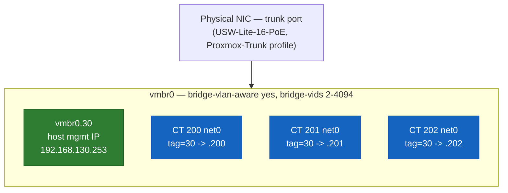

# 🖥️ Proxmox — Hypervisor, Storage, and VLAN-Aware Networking

Hardware, storage strategy, the networking design that lets one bridge serve both host-level and guest-level VLAN membership, and the reasoning behind where Proxmox itself sits in the network. Links to other v2 docs point directly at the relevant heading — there's no numbered `§N` citation scheme, just plain markdown links.

---

## Table of Contents

1. [Hardware](#hardware)
2. [Storage](#storage)
3. [VM/CT numbering convention](#vmct-numbering-convention)
4. [Networking: one bridge, two VLAN mechanisms](#networking-one-bridge-two-vlan-mechanisms)
5. [Where Proxmox lives on the network — and why](#where-proxmox-lives-on-the-network--and-why)
6. [Guests](#guests)
7. [Backup infrastructure (Proxmox Backup Server)](#backup-infrastructure-proxmox-backup-server)
8. [Known issues & lessons](#known-issues--lessons)

---

## Hardware

HP EliteDesk Mini 600 G6 — Intel i5-10500T (6C/12T), 32GB RAM, 2× 500GB NVMe SSD in a ZFS mirror (RAID1). ZFS root.

> **Why it matters:** mirroring the two NVMes means a single drive failure doesn't take the hypervisor down — every guest's rootfs survives on the remaining disk while the failed one is replaced, the same resilience tradeoff a production hypervisor host makes at any scale.

<div align="right"><sub><a href="#table-of-contents">↑ Back to Table of Contents</a></sub></div>

---

## Storage

`local-zfs` — ZFS-backed, inherently thin-provisioned by default, unlike VM zvols which need it configured explicitly. All container rootfs volumes live here, striped across the mirrored NVMe pair described above.

`hdd-pool` — a second, single-disk ZFS pool on a 1TB 2.5" HDD (WD10JPLX, in a caddy) added specifically to host the Proxmox Backup Server datastore (see [Backup infrastructure](#backup-infrastructure-proxmox-backup-server) below), registered as its own Proxmox storage (`zfspool`, mountpoint `/hdd-pool`). Deliberately **not** mirrored — a single physical drive, accepted as a known point of failure for this Tier-1 local/fast-restore backup target, with an eventual NAS becoming Tier-2 off-box backup. The pool spans the whole disk; a fixed-size zvol is carved out for the PBS VM's datastore disk, and the remaining pool space stays available as ordinary ZFS datasets for anything else — datasets draw dynamically from shared pool space (no fixed partitioning), zvols need an explicit resize.

<div align="right"><sub><a href="#table-of-contents">↑ Back to Table of Contents</a></sub></div>

---

## VM/CT numbering convention

VMIDs are split by guest type rather than one flat sequence: **VMs get the 100s, LXC containers get the 200s.** `CT 200`/`201`/`202` (see [Guests](#guests)) predate this convention and were already in the 200s when it was formalized; `VM 100` (Proxmox Backup Server) is the first guest actually assigned under it. The container-to-IP convention (last-two-IP-digits match VMID) still applies within each range — `VM 100` → `.100` by default, though a specific guest can deviate for a good reason (see PBS's actual address in [Backup infrastructure](#backup-infrastructure-proxmox-backup-server)).

<div align="right"><sub><a href="#table-of-contents">↑ Back to Table of Contents</a></sub></div>

---

## Networking: one bridge, two VLAN mechanisms

`vmbr0` runs with `bridge-vlan-aware yes` and an explicit `bridge-vids` range, which unlocks two different ways of putting something onto a specific VLAN through the same physical trunk port:

- **Per-guest tagging.** An LXC container's own `net0` line can specify `tag=N` directly (e.g., `tag=30` for SERVERS) — the vlan-aware bridge handles tagging/untagging traffic to and from that specific guest's virtual NIC, with no separate interface needed per VLAN per guest.
- **A dedicated host-level VLAN sub-interface.** For the Proxmox *host's own* management IP, a classic 802.1Q sub-interface (`vmbr0.30`) rides on top of the same bridge, giving the hypervisor itself a tagged presence on SERVERS without needing its own physical port.



```
auto vmbr0
iface vmbr0 inet manual
        bridge-ports nic0
        bridge-stp off
        bridge-fd 0
        bridge-vlan-aware yes
        bridge-vids 2-4094

auto vmbr0.30
iface vmbr0.30 inet static
        address 192.168.130.253/24
        gateway 192.168.130.254
        vlan-raw-device vmbr0
```

Both mechanisms coexist cleanly on the same bridge and the same physical trunk port (the switch's `Proxmox-Trunk` profile, tagged for SERVERS — see [`unifi.md`](unifi.md)) — there's no conflict between "the host has a tagged IP" and "guests get their own tags," since they're handled by different layers of the same bridge.

<div align="right"><sub><a href="#table-of-contents">↑ Back to Table of Contents</a></sub></div>

---

## Where Proxmox lives on the network — and why

Proxmox's management IP initially sat on the untagged native (MGMT) segment, alongside OPNsense's own base interface, the switch, and the AP — simply because that's where it happened to land during initial provisioning, before VLAN segmentation existed yet. Once VLANs were live, this became a real architectural question worth resolving deliberately rather than leaving as an accident of history: MGMT's entire design purpose is staying the one segment never touched during VLAN work, so a mistake anywhere else can't strand access to the core network gear needed to fix it. A hypervisor running actual production-ish workloads doesn't fit that "core network gear, nothing else" description — it's a workload, not infrastructure you'd use to rescue a broken VLAN.

The alternative considered was dual-homing — giving Proxmox a secondary address on MGMT as an out-of-band fallback, in addition to its primary SERVERS VLAN address, for resilience if SERVERS-side routing or firewall rules ever broke. That idea didn't survive scrutiny: since normal day-to-day access to Proxmox comes from TRUSTED (routed through OPNsense, which already has a full bidirectional Pass rule between TRUSTED and SERVERS), a working fallback IP would need to be reachable from TRUSTED too — and if it's reachable from TRUSTED, the isolation benefit MGMT was supposed to preserve is already gone. A fallback that only works when physically local isn't a fallback for a remotely-managed hypervisor; it's just a second address that adds attack surface without adding real resilience.

Proxmox's management IP now lives entirely on SERVERS (VLAN 30), with no presence on MGMT at all. The tradeoff accepted deliberately: if SERVERS VLAN routing or firewall config ever breaks, the hypervisor becomes unreachable over the network, full stop — local console access becomes the only way in. Clean isolation, at the cost of losing a network-based break-glass path for the hypervisor specifically (core network gear — the firewall, switch, and AP — keep theirs on MGMT, unaffected).

> **Why it matters:** this is the same "workload vs. infrastructure" boundary that governs management-plane segmentation in production networks — the systems used to *fix* a broken network stay on a segment that outages elsewhere can't touch, while everything else, however important, is treated as a workload with an accepted blast radius.

<div align="right"><sub><a href="#table-of-contents">↑ Back to Table of Contents</a></sub></div>

---

## Guests

| VMID | Hostname     | Role                                        | Network                | Status |
| ----- | ------------ | -------------------------------------------- | ------------------------ | ------ |
| 100   | `pbs`        | Proxmox Backup Server (VM)                   | SERVERS `.252`, tag 30  | Live   |
| 200   | `pihole`     | Pi-hole (network-wide DNS + ad-blocking)     | SERVERS `.200`, tag 30  | Live   |
| 201   | `unifi-os`   | UniFi OS Server (Podman, privileged LXC)     | SERVERS `.201`, tag 30  | Live   |
| 202   | `monitoring` | Prometheus + Grafana + exporters             | SERVERS `.202`, tag 30  | Live   |

`VM 100` is the first guest under the [VM/CT numbering convention](#vmct-numbering-convention) above, and the only VM in the fleet so far — everything else is an LXC. Its address (`.252`) deliberately breaks the VMID-matches-last-octet pattern; documented here as a known, intentional exception rather than an inconsistency to "fix" later.

`CT 200` was originally the Docker-based UniFi Network Application, destroyed once the migration to UniFi OS Server (`CT 201`) was confirmed stable (see [`unifi.md`](unifi.md)). Its freed VMID and IP were later reused when Pi-hole was deployed, rather than issuing a new one — consistent with the VMID-to-IP convention below.

`CT 201` runs as a **privileged** LXC — a deliberate, documented exception to running everything unprivileged by default, required because UniFi OS Server's installer needs to write a specific sysctl that the kernel refuses from a non-initial user namespace (i.e., any unprivileged container). Full reasoning and the debugging path that led to this conclusion are in [`unifi.md`](unifi.md).

`CT 200` and `CT 202` are both **unprivileged** LXCs (Debian 13) running Docker via Docker Compose — the default posture for anything that doesn't have `CT 201`'s specific kernel-level requirement. `CT 202` was created with:

```
pct create 202 local:vztmpl/debian-13-standard_13.6-1_amd64.tar.zst \
  --hostname monitoring \
  --net0 name=eth0,bridge=vmbr0,tag=30,ip=192.168.130.202/24,gw=192.168.130.254 \
  --storage local-zfs \
  --rootfs local-zfs:8 \
  --memory 2048 \
  --cores 2 \
  --unprivileged 1 \
  --features nesting=1 \
  --onboot 1
```

`--features nesting=1` is the one flag that's easy to forget and expensive to retrofit — see [Known issues](#known-issues--lessons).

Container-to-IP convention: where practical, a container's last-two-IP-digits match its Proxmox VMID (`CT 202` → `.202`), making the relationship between "which container is this" and "what's its address" readable at a glance without needing to look anything up.

<div align="right"><sub><a href="#table-of-contents">↑ Back to Table of Contents</a></sub></div>

---

## Backup infrastructure (Proxmox Backup Server)

`VM 100` runs Proxmox Backup Server (PBS), deliberately split across both storage tiers rather than living entirely on one:

- **`scsi0` (OS disk, 8G) — `local-zfs`**, on the mirrored NVMe pair. If the HDD ever dies, PBS itself survives cleanly on redundant storage; only the backup data on `scsi1` is lost.
- **`scsi1` (datastore disk, 350G) — a zvol on `hdd-pool`**, the single HDD. This is where actual backup chunks live — the split matters specifically so a single-disk failure doesn't take out the VM *and* its backups together.

> **Why it matters:** this OS/data split is the same reasoning behind never putting a database's WAL and its backups on the same failure domain — the backup target itself needs to survive independently of what it's protecting.

**Provisioning sequence** (`hdd-pool` and its zvol created first, see [Storage](#storage)):

```
# register the HDD's ZFS pool as Proxmox storage
pvesm add zfspool hdd-pool --pool hdd-pool --content images,rootdir

# carve the 350G datastore disk out of it
zfs create -V 350G hdd-pool/pbs-disk

# allocate the OS disk on the NVMe mirror separately (see Known issues —
# qm create can't reliably allocate a new zvol AND reference a raw device
# path in the same invocation)
pvesm alloc local-zfs 100 vm-100-disk-0 8G

# create the VM without scsi0, then attach the disk allocated above
qm create 100 \
  --name pbs \
  --memory 2048 \
  --cores 2 \
  --net0 virtio,bridge=vmbr0,tag=30 \
  --scsihw virtio-scsi-pci \
  --scsi1 /dev/zvol/hdd-pool/pbs-disk \
  --ide2 local:iso/proxmox-backup-server_4.2-1.iso,media=cdrom \
  --boot order=ide2 \
  --ostype l26

qm set 100 --scsi0 local-zfs:vm-100-disk-0
```

**PBS-side setup**, once installed and reachable at `192.168.130.252:8007`:
- Fresh installs need the enterprise repo (`pbs-enterprise`) disabled and the free `pbs-no-subscription` repo enabled before `apt update` will work without a paid subscription — see [Known issues](#known-issues--lessons).
- Datastore: a single-disk directory datastore (`ext4`, name `backups`) on the `hdd-pool` zvol, created via **Administration → Disks → Directory → Create: Directory** with "Add as Datastore" checked — PBS's own chunk-level SHA256 integrity checking makes a second layer of ZFS-on-the-zvol redundant.
- A dedicated, least-privilege user (`pve-backup@pbs`, role `DatastoreBackup` scoped to `/datastore/backups`) authenticates the connection from Proxmox — consistent with the least-privilege service-account pattern used everywhere else in this build (OPNsense's `monitoring-api`, Pi-hole's scoped App Password).

**Backup job** (Proxmox host, `/etc/pve/jobs.cfg`): daily at 03:00, `snapshot` mode, `zstd` compression, targeting `backups-pbs` for `CT 200/201/202`.

**Retention and space reclamation** (PBS side, not the backup job itself — retention on a PBS-backed datastore is managed by PBS's own Prune jobs):
- Prune job `daily-prune`: daily at 04:00, `keep-daily 7 / keep-weekly 4 / keep-monthly 6`.
- Garbage collection: weekly, Sunday 05:00 — offset from the backup/prune window so it isn't contending for I/O with either.

<div align="right"><sub><a href="#table-of-contents">↑ Back to Table of Contents</a></sub></div>

---

## Known issues & lessons

- **`qm create` can hang or time out indefinitely when mixing a storage-managed disk with a raw device-path disk in the same command.** Creating `VM 100` with both `--scsi0 local-zfs:vm-100-disk-0,size=8G` (needs fresh allocation) and `--scsi1 /dev/zvol/hdd-pool/pbs-disk` (an existing raw path) in one `qm create` call left the process polling forever for a zvol device link that was never created — `zfs list -t volume` confirmed the disk never actually got created at the ZFS layer, even though the identical `zfs create` command worked instantly by hand, and `pvesm alloc` (the same primitive `qm create` uses internally) also succeeded instantly in isolation. Root cause not fully identified — isolated to `qm create`'s own disk-allocation orchestration, not the ZFS layer, udev, or the storage plugin, all of which tested healthy independently. Workaround: allocate the storage-managed disk separately first (`pvesm alloc <storage> <vmid> <disk-name> <size>`), create the VM without that disk in the initial `qm create`, then attach it afterward with `qm set <vmid> --scsi0 <storage>:<disk-name>` (no `,size=` — that's what tells Proxmox to attach an existing disk rather than allocate a new one).
- **A fresh PBS/PVE install without a paid subscription needs the enterprise repo disabled manually**, or `apt update` 401s. Current (deb822 `.sources` format) repos don't necessarily ship an `Enabled:` line at all — a `sed` targeting `Enabled: yes` silently does nothing if that line doesn't exist; check with `cat` first, and append `Enabled: false` explicitly if it's missing, rather than assuming the line is present to toggle.
- **Audit `/etc/pve/jobs.cfg` before adding a new backup job.** A pre-existing weekly `vzdump` job (`all=1`, Saturday 03:00, targeting `local`) predated the PBS build and wasn't discovered until after the new daily PBS-targeted job was created — both would have fired at the same time every Saturday, double-backing-up the same guests to two different storages simultaneously. Worth a `cat`/`pvesh get /cluster/backup` check any time a new backup job is added, not just when troubleshooting one that already exists.
- **`/etc/hosts` doesn't follow interface IP changes automatically.** Changing a host's network config updates routing and reachability, but any hostname-to-IP mapping baked into `/etc/hosts` stays stale until manually updated — worth checking any time a host's own IP moves, not just the interface config itself.
- **`ifreload -a` applies interface changes without a full reboot, but still drops the current session** if the interface you're connected through is the one being changed — functionally identical to a reboot from the perspective of "will this session survive," even though the rest of the system stays running throughout.
- **A container's IP and its VMID drift apart over time if not enforced.** The convention only holds if it's actively maintained during provisioning and renumbering — it's not something Proxmox tracks or enforces on its own.
- **Flipping `unprivileged: 0`/`1` on an existing container changes UID mapping going forward, but not retroactively** — see [`unifi.md`](unifi.md) for what happens when that assumption is wrong.
- **Docker inside an unprivileged LXC needs `--features nesting=1` set at `pct create` time.** Without it, the container can't nest the cgroup/namespace machinery Docker itself needs, and the runtime won't start. This isn't something to retrofit cleanly after the fact — set it at creation.

<div align="right"><sub><a href="#table-of-contents">↑ Back to Table of Contents</a></sub></div>
