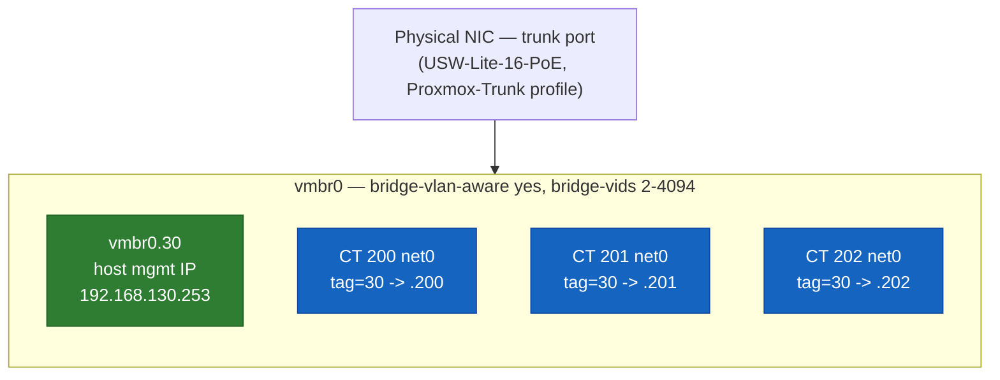

# 🖥️ Proxmox — Hypervisor, Storage, and VLAN-Aware Networking

Hardware, storage strategy, the networking design that lets one bridge serve both host-level and guest-level VLAN membership, and the reasoning behind where Proxmox itself sits in the network. Links to other v2 docs point directly at the relevant heading — there's no numbered `§N` citation scheme, just plain markdown links.

---

## Table of Contents

1. [Hardware](#hardware)
2. [Storage](#storage)
3. [Networking: one bridge, two VLAN mechanisms](#networking-one-bridge-two-vlan-mechanisms)
4. [Where Proxmox lives on the network — and why](#where-proxmox-lives-on-the-network--and-why)
5. [Guests](#guests)
6. [Known issues & lessons](#known-issues--lessons)

---

## Hardware

HP EliteDesk Mini 600 G6 — Intel i5-10500T (6C/12T), 32GB RAM, 2× 500GB NVMe SSD in a ZFS mirror (RAID1). ZFS root.

> **Why it matters:** mirroring the two NVMes means a single drive failure doesn't take the hypervisor down — every guest's rootfs survives on the remaining disk while the failed one is replaced, the same resilience tradeoff a production hypervisor host makes at any scale.

<div align="right"><sub><a href="#table-of-contents">↑ Back to Table of Contents</a></sub></div>

---

## Storage

`local-zfs` — ZFS-backed, inherently thin-provisioned by default, unlike VM zvols which need it configured explicitly. All container rootfs volumes live here, striped across the mirrored NVMe pair described above. A dedicated bay is reserved for a future local Proxmox Backup Server datastore once the NAS build frees it up (see main [`README.md` §Planned](README.md#planned--not-yet-built)) — Tier-1, fast local restore, with the NAS becoming Tier-2 off-box backup afterward.

<div align="right"><sub><a href="#table-of-contents">↑ Back to Table of Contents</a></sub></div>

---

## Networking: one bridge, two VLAN mechanisms

`vmbr0` runs with `bridge-vlan-aware yes` and an explicit `bridge-vids` range, which unlocks two different ways of putting something onto a specific VLAN through the same physical trunk port:

- **Per-guest tagging.** An LXC container's own `net0` line can specify `tag=N` directly (e.g., `tag=30` for SERVERS) — the vlan-aware bridge handles tagging/untagging traffic to and from that specific guest's virtual NIC, with no separate interface needed per VLAN per guest.
- **A dedicated host-level VLAN sub-interface.** For the Proxmox *host's own* management IP, a classic 802.1Q sub-interface (`vmbr0.30`) rides on top of the same bridge, giving the hypervisor itself a tagged presence on SERVERS without needing its own physical port.



```
auto vmbr0
iface vmbr0 inet manual
        bridge-ports nic0
        bridge-stp off
        bridge-fd 0
        bridge-vlan-aware yes
        bridge-vids 2-4094

auto vmbr0.30
iface vmbr0.30 inet static
        address 192.168.130.253/24
        gateway 192.168.130.254
        vlan-raw-device vmbr0
```

Both mechanisms coexist cleanly on the same bridge and the same physical trunk port (the switch's `Proxmox-Trunk` profile, tagged for SERVERS — see [`unifi.md`](unifi.md)) — there's no conflict between "the host has a tagged IP" and "guests get their own tags," since they're handled by different layers of the same bridge.

<div align="right"><sub><a href="#table-of-contents">↑ Back to Table of Contents</a></sub></div>

---

## Where Proxmox lives on the network — and why

Proxmox's management IP initially sat on the untagged native (MGMT) segment, alongside OPNsense's own base interface, the switch, and the AP — simply because that's where it happened to land during initial provisioning, before VLAN segmentation existed yet. Once VLANs were live, this became a real architectural question worth resolving deliberately rather than leaving as an accident of history: MGMT's entire design purpose is staying the one segment never touched during VLAN work, so a mistake anywhere else can't strand access to the core network gear needed to fix it. A hypervisor running actual production-ish workloads doesn't fit that "core network gear, nothing else" description — it's a workload, not infrastructure you'd use to rescue a broken VLAN.

The alternative considered was dual-homing — giving Proxmox a secondary address on MGMT as an out-of-band fallback, in addition to its primary SERVERS VLAN address, for resilience if SERVERS-side routing or firewall rules ever broke. That idea didn't survive scrutiny: since normal day-to-day access to Proxmox comes from TRUSTED (routed through OPNsense, which already has a full bidirectional Pass rule between TRUSTED and SERVERS), a working fallback IP would need to be reachable from TRUSTED too — and if it's reachable from TRUSTED, the isolation benefit MGMT was supposed to preserve is already gone. A fallback that only works when physically local isn't a fallback for a remotely-managed hypervisor; it's just a second address that adds attack surface without adding real resilience.

Proxmox's management IP now lives entirely on SERVERS (VLAN 30), with no presence on MGMT at all. The tradeoff accepted deliberately: if SERVERS VLAN routing or firewall config ever breaks, the hypervisor becomes unreachable over the network, full stop — local console access becomes the only way in. Clean isolation, at the cost of losing a network-based break-glass path for the hypervisor specifically (core network gear — the firewall, switch, and AP — keep theirs on MGMT, unaffected).

> **Why it matters:** this is the same "workload vs. infrastructure" boundary that governs management-plane segmentation in production networks — the systems used to *fix* a broken network stay on a segment that outages elsewhere can't touch, while everything else, however important, is treated as a workload with an accepted blast radius.

<div align="right"><sub><a href="#table-of-contents">↑ Back to Table of Contents</a></sub></div>

---

## Guests

| VMID | Hostname     | Role                                        | Network                | Status |
| ----- | ------------ | -------------------------------------------- | ------------------------ | ------ |
| 200   | `pihole`     | Pi-hole (network-wide DNS + ad-blocking)     | SERVERS `.200`, tag 30  | Live   |
| 201   | `unifi-os`   | UniFi OS Server (Podman, privileged LXC)     | SERVERS `.201`, tag 30  | Live   |
| 202   | `monitoring` | Prometheus + Grafana + exporters             | SERVERS `.202`, tag 30  | Live   |

`CT 200` was originally the Docker-based UniFi Network Application, destroyed once the migration to UniFi OS Server (`CT 201`) was confirmed stable (see [`unifi.md`](unifi.md)). Its freed VMID and IP were later reused when Pi-hole was deployed, rather than issuing a new one — consistent with the VMID-to-IP convention below.

`CT 201` runs as a **privileged** LXC — a deliberate, documented exception to running everything unprivileged by default, required because UniFi OS Server's installer needs to write a specific sysctl that the kernel refuses from a non-initial user namespace (i.e., any unprivileged container). Full reasoning and the debugging path that led to this conclusion are in [`unifi.md`](unifi.md).

`CT 200` and `CT 202` are both **unprivileged** LXCs (Debian 13) running Docker via Docker Compose — the default posture for anything that doesn't have `CT 201`'s specific kernel-level requirement. `CT 202` was created with:

```
pct create 202 local:vztmpl/debian-13-standard_13.6-1_amd64.tar.zst \
  --hostname monitoring \
  --net0 name=eth0,bridge=vmbr0,tag=30,ip=192.168.130.202/24,gw=192.168.130.254 \
  --storage local-zfs \
  --rootfs local-zfs:8 \
  --memory 2048 \
  --cores 2 \
  --unprivileged 1 \
  --features nesting=1 \
  --onboot 1
```

`--features nesting=1` is the one flag that's easy to forget and expensive to retrofit — see [Known issues](#known-issues--lessons).

Container-to-IP convention: where practical, a container's last-two-IP-digits match its Proxmox VMID (`CT 202` → `.202`), making the relationship between "which container is this" and "what's its address" readable at a glance without needing to look anything up.

<div align="right"><sub><a href="#table-of-contents">↑ Back to Table of Contents</a></sub></div>

---

## Known issues & lessons

- **`/etc/hosts` doesn't follow interface IP changes automatically.** Changing a host's network config updates routing and reachability, but any hostname-to-IP mapping baked into `/etc/hosts` stays stale until manually updated — worth checking any time a host's own IP moves, not just the interface config itself.
- **`ifreload -a` applies interface changes without a full reboot, but still drops the current session** if the interface you're connected through is the one being changed — functionally identical to a reboot from the perspective of "will this session survive," even though the rest of the system stays running throughout.
- **A container's IP and its VMID drift apart over time if not enforced.** The convention only holds if it's actively maintained during provisioning and renumbering — it's not something Proxmox tracks or enforces on its own.
- **Flipping `unprivileged: 0`/`1` on an existing container changes UID mapping going forward, but not retroactively** — see [`unifi.md`](unifi.md) for what happens when that assumption is wrong.
- **Docker inside an unprivileged LXC needs `--features nesting=1` set at `pct create` time.** Without it, the container can't nest the cgroup/namespace machinery Docker itself needs, and the runtime won't start. This isn't something to retrofit cleanly after the fact — set it at creation.

<div align="right"><sub><a href="#table-of-contents">↑ Back to Table of Contents</a></sub></div>
